该项目是ICRA2020 AI Challenge I Hiter战队的Perception功能代码展示
# **1. 软件功能介绍**  
感知部分软件功能包括**敌方机器人装甲板识别**、**敌方机器人位置识别**、**敌方机器人姿态识别及预测**以及**哨岗识别敌方机器人**四个功能。其中：
* **敌方机器人装甲板识别以及哨岗识别敌方机器人算法**通过深度学习目标检测算法实现，以RGB图像作为输入，稳定的输出视野中敌方机器人及装甲板的二维边界框信息。为机器人提供敌方机器人在环境中的大致位置信息。  
* **敌方机器人位置及姿态识别算法**以RGB摄像头数据流作为输入，可以识别出图像内的敌方机器人像素坐标，并且通过模板匹配的方式对机器人位置以及姿态信息进行估计。在2.5m距离内具有较好的计算效果，可以稳定的提供敌方机器人相对位置、车身姿态、装甲板编号及位置信息。
* **敌方机器人姿态预测算法**使用强跟踪卡尔曼滤波算法，以敌方机器人位姿作为输入，预测未来敌方机器人的姿态以及最佳打击位置。在2.5m内有较为稳定的跟踪效果。  

# **2. 软件效果展示**  
机器人与装甲板识别算法是基于TinyYOLOv3模型进行改进的，本次任务中，目标只有两类：机器人和装甲板，因此，优先选择轻量模型。为了进一步提高识别的准确率同时不增加参数，在原本的TinyYOLOv3模型中增加了SPP模块，有效提高了算法识别的稳定性。该模型尚未进行任何诸如TensorRT等加速，在GTX-1660ti GPU上的推理速度高达100 FPS，完全具备实时性。哨岗机器人识别算法采用的是基于TinyYOLOv2模型进行改进的SlimYOLOv2，考虑到哨岗的视野不变化，目标的大小不会有明显的波动，因此，采用单一尺度来进行检测即可满足要求，相较于原版的TinyYOLOv2，我们的SlimYOLOv2在不损失过多速度的前提上，识别更加准确和稳定，并且，在GTX 1660ti GPU上仍具备接近100 FPS的实时检测速度。  
机器人位姿识别算法可以在2.5m范围内稳定的识别出敌方机器人可视灯条在己方机器人坐标系下的位置，滤除地面反光，并通过快速的模板匹配方法得到敌方机器人的全身姿态，以敌方机器人中心为基准进行位姿预测，可以避免由于对装甲板进行预测导致的旋转过程跟踪中断问题，并连续的寻找最佳打击位置。随着敌方机器人距离变大，定位识别效果变差，通过非线性优化方法减少了数据的波动，进一步提高远距离的识别精度。在关闭可视化效果的情况下算法在i7-6700HQ平台上可以达到8ms/帧的计算速度。配合高帧率摄像头实现稳定跟踪预测。
<p align="center"></p>   
<p align="center">哨岗目标检测</p>  
<p align="center"></p>   
<p align="center">机器人目标检测</p>  
<p align="center"></p>   
<p align="center">基于先验信息和模板匹配的位姿识别</p>  
<p align="center"></p>  
<p align="center">机器人全身姿态识别及预测</p>  

# **3. 依赖工具，软、硬件环境**
**软件部分：**   
我们在Ubuntu16.04系统上测试运行了软件系统，但是在Ubuntu14.04、Ubuntu18.04等其他平台上应该也可以顺利编译运行。敌方机器人位置识别和姿态识别及预测算法通过C++语言进行编写，在CPU上运行，使用高性能的处理器可以保证算法的运行效果。机器人及装甲板识别和哨岗识别算法通过Python语言进行编写，运行效果对GPU有一定要求。  
**硬件部分：**   
传感器：Dahua A5131CU210 型号摄像头，镜头焦距6mm，摄像头采用全局快门，分辨率1280*1024，帧率 210   
计算平台：Intel i9-9900K + TITAN RTX
### **Armor_Detector程序部分：**  
Armor_Detector程序部分使用C++语言编写。以RGB图像作为输入，计算敌方机器人相对于己方机器人坐标系下的坐标以及预测敌方机器人的运动。
### C++11编译器
代码在C++11环境下编译运行，在其他版本编译器上不能保证编译通过
### OpenCV  
我们使用OpencCV库来进行图像和特征处理。OpenCV的安装和使用指导文件可以参考 http://opencv.org 。 实验使用OpenCV版本为 OpenCV 3.4.4
### Eigen  
我们使用了Eigen库的一些基本线性代数算法。Eigen库的下载安装和基本使用指导可以参考
http://eigen.tuxfamily.org 。 实验使用Eigen版本为 Eigen 3.3.5 
 
### **RobDot程序部分：** 
RobDot程序部分使用python语言编写，用于机器人及哨岗的目标检测。以RGB图像作为输入，输出敌方机器人及装甲板在视野内的二维边界框信息。  
### Anaconda 5.1.0  
Anaconda是一个python环境管理工具，目标检测部分代码环境是通过Anaconda的集成环境搭建的  
### python3.5/3.6  
算法可以在python3.5以及python3.6环境下运行  
### numpy  
numpy是用于维度数组与矩阵运算的python拓展库，根据对应的版本进行选择即可  
### python-opencv  
opencv是图像处理开源软件，用于图像处理  
### Pytorch-gpu >= 1.1.0  
Pytorch-gpu是基于gpu运算的深度学习处理库，用于训练以及运行深度学习模型  
### Tensorborad-1.14.0（选装）  
Tensorborad是用于深度学习过程可视化的软件，如没有训练要求可以选择性安装  

# **4. 编译、安装方式**
克隆代码至本地仓库：
```git clone https://github.com/MengXiangBo/ICRA2020_RM_IHiter_Perception.git Perception```
执行如下代码：
 ```
cd Armor_Detector
mkdir build
cd build
cmake -DCMAKE_BUILD_TYPE=Release ..
make -j4
 ```
代码执行完毕将会在Armor_Detector项目目录的bin文件夹下生成编译文件，下载测试视频后在该路径下运行可执行文件即可测试算法demo  

# **5. 软件使用说明** 
## ***A. 深度学习目标检测算法***   
深度学习目标检测算法用来实现敌方机器人的识别以及哨岗识别，使用python语言编写，算法代码位于RobDet文件夹下。本项目共提供两组模型：

- 部署在机器人平台的检测模型——TinyYOLOv3，该模型是由我们组对Darknet版本的TinyYOLOv3的PyTorch复现，添加了SPP模块。
- 部署在哨岗平台的检测模型——SlimYOLOv2，该模型是由我们组对Darknet版本的YOLOv2的PyTorch复现，并且做了轻量化处理和添加SPP模块。

其中，我们将YOLOv2中的backbone网络——Darknet19替换为由我们自主设计的轻量级网络Darknet_tiny，该网络在ImageNet数据集上进行预训练，在val上获得
top1精度63.5和top5精度85.06。为了提高网络的性能，同时不引入过多的计算量，在detection head部分添加了SPP模块。

## 数据集
本项目的数据集由我们自主采集，使用相机在不同视角、不同距离、不同姿态下采集。训练集共有2400张图片，目前尚未开源数据集。

## 模型
### Backbone 预训练模型
预训练模型请到下面的百度云链接下载：

链接：https://pan.baidu.com/s/1_iqu6YXyk91uMN98wtQrDw 

提取码：9b3i

### 检测模型
已训练好的模型请使用下面的百度云链接下载：

链接：https://pan.baidu.com/s/1o6_Kjv_PrTWCp4wZ_csbCg 

提取码：m2i3

## 训练
假定已有训练集，并且接口合适，则使用下面的命令即可训练，以TinyYOLOv3为例：

```Shell
python train.py -v tiny_yolo_v3 -hr --cuda --num_workers 8
```

其中，-hr参数用于载入在ImageNet上经过448分辨率图像finetune的高清模型；--cuda参数用于调用GPU；--num_workers参数用于设置PyTorch中的dataloader中的
线程数。

另外，本项目支持多尺度训练，例如：

```Shell
python train.py -v tiny_yolo_v3 -hr --cuda -ms --num_workers 0
```

调用-ms参数即可，由于本项目存在尚未解决的问题，调用多尺度训练时，需要将num_workers设为0，从而只调用主线程来进行训练，训练速度会变慢。

## 测试
测试代码请查看```demo.py```，其中，我们支持三种测试模型：
- 调用摄像头，对应命令行参数   --mode camera
- 使用静态图像，对应命令行参数 --mode image
- 使用离线视频，对应命令行参数 --mode video

以TinyYOLOv3为例：

```Shell
python demo.py -v tiny_yolo_v3 --cuda --mode --path_to_img [请输入您的路径] --trained_model [请输入您的保存模型的路径]
```

测试时，默认图像大小为 640x640，可视化阈值为0.2

## 其他
更多的配置参数，如训练次数，anchor box尺寸等，可打开```data/config.py```文件自行查看。  

## ***B. 机器人位姿识别及位姿预测算法***  
机器人位姿识别及位姿预测算法以摄像头为传感器，实现视野内敌方机器人的位姿参数化识别以及预测敌方机器人在下一时刻的状态。算法使用C++语言编写，位于Armor_Detector文件夹下。测试算法demo使用了特定的曝光时间及图像设置，并且在固定的相机外参下运行，算法的测试demo视频可以从提供的百度云链接提取并放置在Armor_Detector目录下的video文件夹下。

链接：https://pan.baidu.com/s/1DQnMjTkkXw_xls0mx9HKhQ 

提取码：gfhf

程序编译完成并且在指定位置设置完测试视频即可在bin文件夹下运行
```
./Armor_Detector
```
测试代码的运行效果，代码的运行速度和是否显示测试视频以及编译模式有关。

# **6. 文件目录结构及文件用途说明**   
 ```
.
├── Armor_Detector
│   ├── bin // 保存生成的可执行文件
│   ├── lib // 保存库文件
│   ├── output // 机器人位置输出文件
│   ├── SIGN // 装甲板模板
│   ├── video // 测试用视频
│   ├── armor_detect.cpp // armor_detect类实现
│   ├── armor_detect.h // 外部调用时的程序接口
│   ├── camera.cpp // camera类实现
│   ├── camera.h // 存储相机内参、坐标变换相关函数实现
│   ├── CMakeLists.txt
│   ├── enemy.cpp // enemy类实现
│   ├── enemy.h // 存储敌方机器人基本信息
│   ├── lightbar.cpp // lightbar类实现
│   ├── lightbar.h // 存储装甲板灯条的位置信息，以及灯条识别及位置计算相关函数
│   ├── main.cpp // demo主函数实现
│   ├── optimize.cpp // optimize类实现
│   ├── optimize.h // 非线性优化相关函数实现，通过计算出的灯条位置，优化机器人姿态
│   ├── predict.cpp // predict类实现
│   └── predict.h // 强跟踪卡尔曼滤波的实现
├── RobDet
│   ├── backbone
│   │   ├── darknet.py // backbone网络结构代码
│   │   ├── __init__.py
│   │   └── weights // 预训练模型
│   ├── data
│   │   ├── config.py // 参数配置文件
│   │   ├── demo // 存储一些demo的图片
│   │   ├── __init__.py
│   │   └── rm.py // 读取训练和测试使用数据的代码
│   ├── models
│   │   ├── slim_yolo_v2.py // 模型文件
│   │   └── tiny_yolo_v3.py // 模型文件
│   ├── utils
│   │   ├── augmentations.py // 数据增强代码
│   │   ├── com_paras_flops.py
│   │   ├── __init__.py
│   │   └── modules.py // 神经网络模块代码
│   ├── weights
│   │   └── rm
│   ├── tools.py // 损失函数、制作label、计算loss等代码
│   ├── train.py // 训练代码
│   ├── demo.py // demo代码
│   └── generate_ab_kmeans.py // kmeans获取anchor_box代码
├── GIF
├── PIC
├── LICENSE // 开源协议
└── Readme.md // 说明文件
```  

# **7. 原理介绍与理论支持分析**   
## 1. 机器人与装甲板识别及哨岗识别  
&emsp;&emsp;为实现自动识别视野中敌方机器人与装甲板，本方案中使用基于深度学习的目标检测算法。现有的目标检测算法，诸如Faster-RCNN、SSD、YOLO等先进的检测算法模型，已在公开数据集PASCAL VOC与MSCOCO上均表现出了优异的性能和识别精度，但是这些算法模型过大，依托于TITAN X这一类的高性能、高成本的GPU来保证目标检测的实时性。考虑到比赛中所使用的AI机器人无法承载高性能GPU及其相关硬件配置，不能为以上的模型提供足够的算力支持，我们队伍改进YOLO-v1算法，将其轻量化，使其能够在较低性能的GTX-1060-modile GPU上具有40+FPS的快速检测能力。
&emsp;&emsp;目标检测网络从功能上，可以分为两部分：主干网络（Backbone）和检测网络（Detection head）。前者负责从输入图像中提取感兴趣的目标特征，后者利用这些特征进行检测，识别出目标的类别并定位。主干网络这一部分，本方案使用轻量网络ResNet-18，其网络结构如图一所示。ResNet-18包含的参数量为11.69M，浮点计算量为1.58GFLOPs，其较少的参数量和计算量，适用于低性能GPU。  
<p align="center">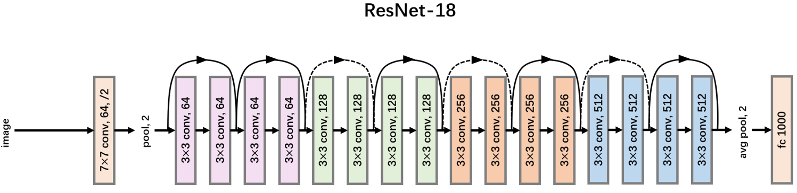</p>  
<p align="center">图7-1 ResNet-18网络结构</p>  
&emsp;&emsp;检测网络中，本方案使用简单的网络结构，如图二所示，图中展示的Block模块由一层1×1的reduction卷积层接3×3卷积层构成。这样简易的结构既能增加网络结构的深度，同时还不会带来过多的参数和计算量，有助于将模型部署在低性能GPU上。  
<p align="center">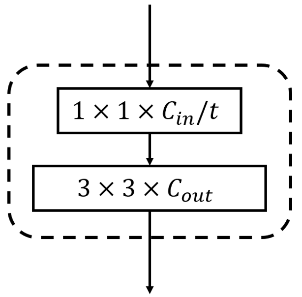</p>  
<p align="center">图7-2 Block结构</p>  
&emsp;&emsp;结合以上两部分，便可以搭建本方案中所使用的目标检测网络RobDet，其整体结构如图三所示。给定输入图片，主干网络首先在图像中提取特征。这里，为了加快网络的收敛速度，本方案使用ResNet-18在ImageNet上已经预训练好的模型，将其加载到主干网络中。主干网路在提取出特征后，输出特征图，并由后续的检测网络实现对视野中的机器人及其装甲板的识别和定位。  
<p align="center"></p>  
<p align="center">图7-3 Block结构</p>  
&emsp;&emsp;为了完成此目标，本方案中采用dahua-A5131CU210单目相机采集机器人及其装甲板的训练集图像。共采集不同角度和距离下的机器人图片1784张，部分结果如图四所示。训练模型所需的实验设备为Intel i9-9940CPU和一块TITAN RTX显卡。训练中，batch大小设置为64，初始学习率为0.001，训练90个epoch，每30个epoch，学习率降低10%。训练过程中的损失函数曲线在图四中给出。  
<p align="center">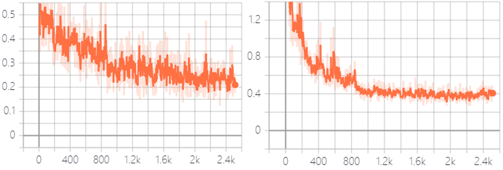</p>  
<p align="center">图7-4 训练曲线 左图：类别识别损失函数曲线 右图：定位损失函数曲线</p>   
<p align="center">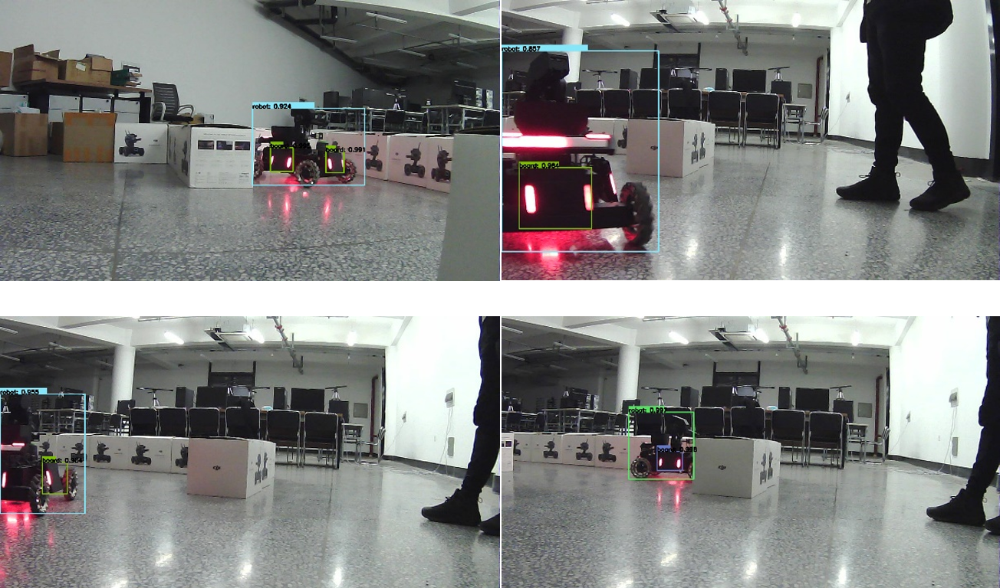</p>  
<p align="center">图7-5 部分RobDet检测结果的可视化</p>  
<p align="center">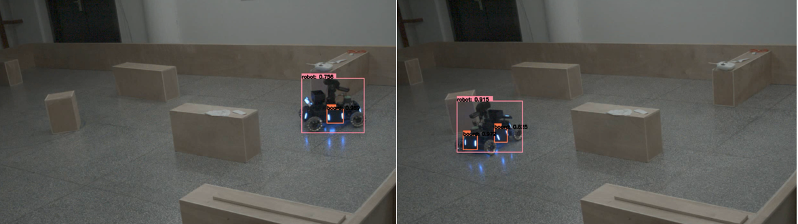  
<p align="center">图7-6 哨岗识别效果</p>  

## 2. 机器人位置识别与姿态估计  
&emsp;&emsp;首先对单个灯条位置识别来分别测算机器人各个部分位置。适当降低相机曝光度，对输入图像二值化、腐蚀、膨胀、滤波、寻找轮廓、根据条件筛选轮廓、计算二阶中心矩得到多个灯条在图像坐标系下中心位置。结果如图7-7所示：
<p align="center">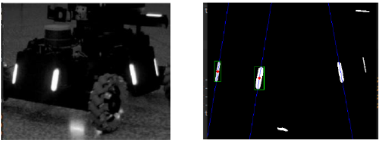</p>  
<p align="center">图7-7 装甲板识别效果</p>  
&emsp;&emsp;单个灯条位置的计算方式如图2所示。通过机器人的先验信息可以得到参数h，通过灯条图像坐标可以计算得到θ和β。这样就可以计算得到灯条距机器人距离r和d，并由r、d、θ、β计算得到灯条坐标。
<p align="center">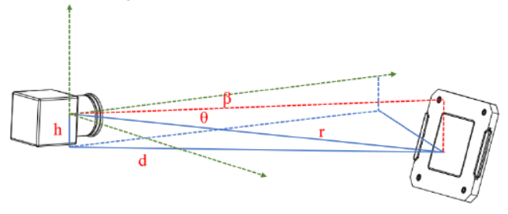</p>  
<p align="center">图7-8 相机-灯条位置关系</p>  
&emsp;&emsp;通过三个毗邻的灯条可以确定一个装甲板，通过一个装甲板可以得到四个机器人先验位姿以及两个机器人先验中心。如图7-9所示：   
<p align="center"></p>  
<p align="center">图7-9 机器人姿态假设</p>  
&emsp;&emsp;在不考虑机器人底盘正方向的前提下，四个机器人先验位姿共有两个机器人底盘朝向假设。分别对这两种机器人底盘朝向假设进行验证，就可以将机器人先验位姿假设由四种减少至两种。剩余的两种位姿假设会产生两种尾部灯条姿态，在分别对两种尾部灯条姿态进行验证就可以唯一确定机器人姿态。
计算机器人位姿的具体步骤为： 

***1）*** 首先通过机器人装甲板两侧灯条的中心距先验信息以及灯条位置的不确定椭圆，使用LM非线性优化方法优化机器人灯条位置，如图4-a所示。  

<p align="center">
  <br>
  
</p>  

$$Error1 = \sum \limits_i^{n - 1} {\left( {groundtrut{h_{dist\left[ i \right]}} - dist\left( {point\left[ i \right],point\left[ {i + 1} \right]} \right)} \right)^2}$$  
&emsp;&emsp;$Error1$用来保证灯条位置间满足距离约束。  

<p align="center">
  <br>
  
</p>  

$$Error2 = \sum \limits_i^n \left( {dist{{\left( {point\left[ i \right],point\left[ {i - 1} \right]} \right)}^T}{\Sigma ^{ - 1}}dist\left( {point\left[ i \right],point\left[ {i - 1} \right]} \right)} \right)$$  
$Error2$马氏距离用来权衡灯条优化后的位置偏离原始坐标的概率惩罚。 

<p align="center">
  <br>
  
</p>  

$$Error = Error1 + Error2$$   
***2）*** 将两种底盘假设下的麦克纳姆轮位置投影至图像坐标系生成boundingbox，在boundingbox附近图像区域内和数据集进行模板匹配。以两种假设下的概率最高者为作为机器人姿态。在以该姿态为基础将灯条先验位置投影至图像坐标系，进行剩余两种姿态的检测。过程如图所示，图像含义为，当前观测到的装甲板是前向或后向装甲板，和灯条检测结合，估计出机器人尾部位姿如图4-b所示。  
<p align="center">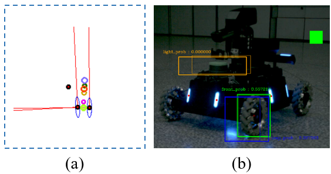</p>  
<p align="center">图7-10 机器人姿态识别</p>  
&emsp;&emsp;通过以上两个步骤即可在2.5m范围内稳定的估计出敌方机器人在当前机器人坐标系下的位置和姿态。进而为敌方机器人姿态预测提供依据。  

### 3. 机器人姿态预测  
&emsp;&emsp;将机器人运动描述为平面内的无约束运动形式。首先通过机器人位姿估计算法计算敌方机器人相对于己方机器人的运动。Demo敌方机器人的x，y坐标随时间变化曲线如图7-11所示，在2.5m范围内机器人的位姿状态估计十分平滑，随着机器人间距离的加大，姿态估计效果出现越来越大的噪音。  
<p align="center">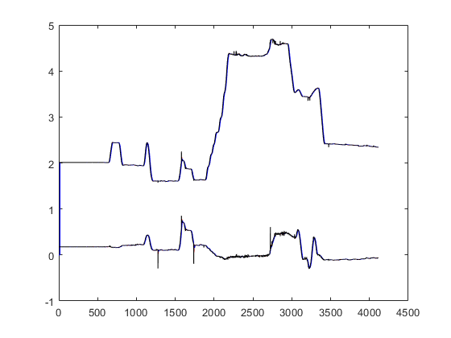</p>   
<p align="center">图7-11 位姿变化</p>  
&emsp;&emsp;中对x，y，theta三个部分进行分别预测，由于预测时间会随着敌方机器人距己方机器人距离远近而发生变化，机器人位置较远的时候观测方差较大，且由于机器人姿态估计的不稳定性，很容易出现尖峰噪点。机器人坐标随时间的局部变化关系如图7-12所示，黑色线表示计算得到的坐标，红色线表示最近5帧的平均值，用av5表示，蓝色线表示最近15帧的平均值，用av15表示。平均值有较好的轨迹平滑效果，这里使用av5作为预测值，可以在迟滞较小的情况下获得比较平滑的坐标曲线，始预测过程更加准确。  
<p align="center">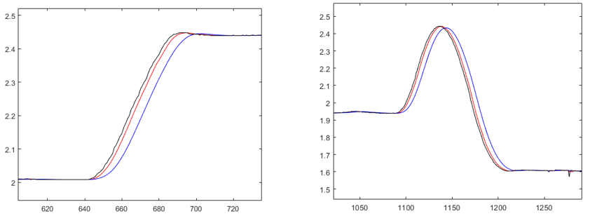</p>  
<p align="center">图7-12 局部位姿变化</p>  
&emsp;&emsp;使用基于Kalman Fliter改进的强跟踪滤波器进行敌方运动的预测。因为比赛时的机器人属于高机动目标，且我们认为装甲运动为时间相关模型，测量噪声为高斯白噪声，所以我们采用了Singer模型作为运动模型。  

&emsp;&emsp;Singer模型假设目标的机动加速度a(t)服从零均值的一阶时间相关过程，其自相关函数为  

<p align="center">
  <br>
  
</p>  

$${R_a}(f) = E[a(t)a(t + f)] = e_a^2{e^{ - \alpha |f|}}(\alpha  \ge 0)$$
&emsp;&emsp;其中，$𝑒_𝑎^2为机动加速度方差，α为机动时间常数fm的倒数，即机动频率，通常取经验值。对时间自相关函数应用Wiener-Kolmogorov白化后，机动加速度可以用输入为白噪声的一阶时间相关模型来表示，即  

<p align="center">
  <br>
  
</p>  

$$a(t) =  - \alpha a(t) + w(t) $$  
&emsp;&emsp;其中w(t)是零均值白噪声，方差为2α𝑒𝑎2，由此可以得到连续时间系统下该模型的状态微分方程为  

<p align="center">
  <br>
  
</p>  

$$\begin{bmatrix}\dot x(t) \\ \ddot x(t)\\ \dot{\ddot x}(t) \end{bmatrix} = \begin{bmatrix}\ 0&1&0 \\ 0&0&1 \\ 0&0&-a \end{bmatrix}\begin{bmatrix}\ x(t) \\ \dot x(t) \\ \ddot x(t) \end{bmatrix} + \begin{bmatrix}\ 0 \\ 0 \\ 1 \end{bmatrix}w(t)$$
&emsp;&emsp;离散形式为：  

<p align="center">
  <br>
  
</p>  

$$x(k+1)=F\ast x(k)=\begin{bmatrix}1&T&(\alpha T-1+e^{-\alpha T})/\alpha ^2 \\ 0&1&(1-e^{-\alpha T})/\alpha \\ 0&0&e^{-\alpha T} \end{bmatrix}\begin{bmatrix}\ x(t) \\ \dot x(t)\\ \ddot x(t) \end{bmatrix}$$
&emsp;&emsp;观测矩阵为：  

<p align="center">
  <br>
  
</p>  

$$Z(k+1)=H(k)X(k+1|k)=\begin{bmatrix}1&0&0 \end{bmatrix}\begin{bmatrix} x(t) \\ \dot x(t)\\ \ddot x(t) \end{bmatrix}$$
&emsp;&emsp;为了使滤波器适用于高机动情况，需要修改卡尔曼增益，利用预报残差的增大，使得下列公式成立，残差序列仍然保持正交，就可以实现滤波器对实际系统状态的跟踪：  

<p align="center">
  <br>
  
</p>  

$$E[\gamma (k+1+j)\gamma ^T (k+1+j)]=0 \space\space k=0,1,2...;j=0,1,2...$$
&emsp;&emsp;引入时变渐消因子𝜆(𝑘+1) ，遗忘因子𝛽，以及弱化因子 𝜌，构成新的强跟踪滤波器：  
<p align="center">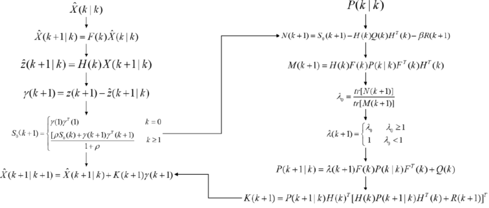</p>  
<p align="center">图7-13 强跟踪卡尔曼滤波算法流程</p>  
使用强跟踪卡尔曼滤波器对机器人x，y，theta三个参数进行预测跟踪，计算得到最佳打击位置。  

# **8. 数据流图及软件框图**  
<p align="center">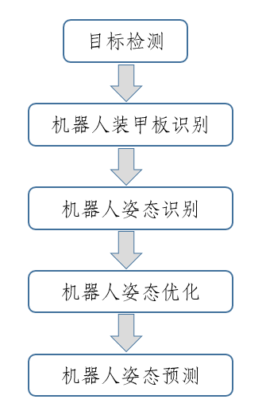</p>  
<p align="center">图8-1 软件框图</p>  
<p align="center"></p>  
<p align="center">图8-2 总数据流框图</p>  